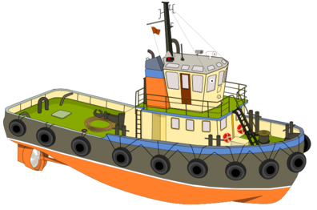

`tug` implements different numerical approaches for transport
problems, notably diffusion with implicit BTCS (Backward Time, Central
Space) Euler and parallel 2D ADI (Alternating Direction Implicit).

# About

This project aims to provide a library for solving transport problems -
diffusion, advection - on uniform grids implemented in C++. The library
is built on top of
[Eigen](https://eigen.tuxfamily.org/index.php?title=Main_Page),
providing easy access to its optimized data structures and linear
equation solvers.

We designed the API to be as flexible as possible. Nearly every
built-in, framework or third-party data structure can be used to model a
problem, as long a pointer to continuous memory can be provided. We also
provide parallelization using [OpenMP](https://www.openmp.org/), which
can be easily turned on/off at compile time.

At the current state, both 1D and 2D diffusion problems on a regular
grid with constant alpha for all grid cells can be solved reliably.

# Requirements

- C++17 compliant compiler
- [CMake](https://cmake.org/) >= 3.18
- [Eigen](https://eigen.tuxfamily.org/) >= 3.4.0

# Getting started

`tug` is designed as a framework library and it relies on
[CMake](https://cmake.org/) for building. If you already use
`CMake` as your build toolkit for your application, you\'re
good to go. If you decide not to use `CMake`, you need to
manually link your application/library to `tug`.

1. Create project directory.

```bash
mkdir sample_project && cd sample_project
```

2. Clone this repository into path of choice project directory

3. Add the following line into `CMakeLists.txt` file:

```bash
add_subdirectory(path_to_tug EXCLUDE_FROM_ALL)
```

4. Write application/library using `tug`\'s API, notably
    including relevant headers (see examples).

5. Link target application/library against `tug`. Do this by
    adding into according `CMakeLists.txt` file:

```bash
target_link_libraries(<your_target> tug)
```

6. Build your application/library with `CMake`.

# Usage in an application

Using `tug` can be summarized into the following steps:

1. Define problem dimensionality
2. Set grid sizes for each dimension
3. Set the timestep
4. Define boundary conditions
5. Run the simulation!

This will run a simulation on the defined grid for one species. See the
source code documentation of `tug` and the examples in the
`examples/` directory for more details.

# Contributing

In this early stage of development every help is welcome. To do so,
there are currently the following options:

Given you have an account for GFZ\'s `gitlab` instance:

1. Fork this project, create a branch and push your changes. If your
    changes are done or you feel the need for some feedback create a
    merge request with the destination set to the **main** branch of
    this project.
2. Ask for access to this repository. You most likely will get access
    as a developer which allows you to create branches and merge
    requests inside this repository.

If you can\'t get access to this `gitlab` instance:

- Download this repository and note down the SHA of the downloaded commit. Apply
    your changes and send a mail to <mluebke@gfz-potsdam.de> or
    <delucia@gfz-potsdam.de> with the patch/diff compared to your starting
    point. Please split different patch types (feature, fixes, improvements ...)
    into seperate files. Also provide us the SHA of the commit you\'ve
    downloaded.

Thank you for your contributions in advance!
