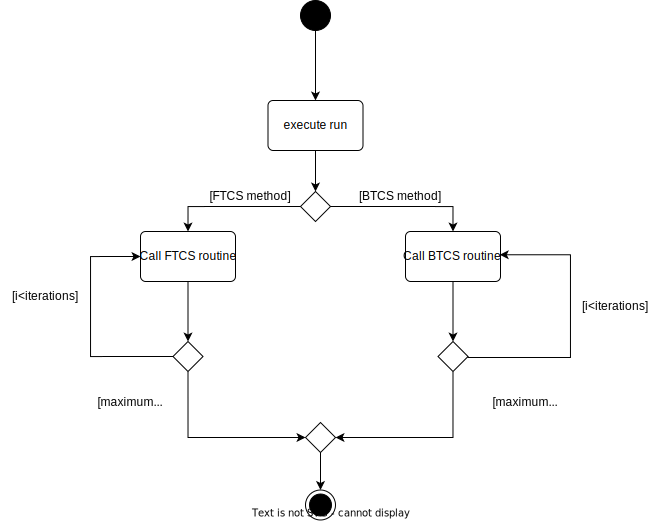
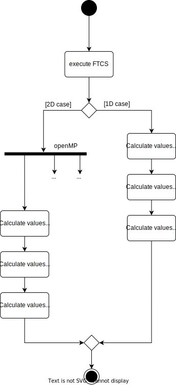
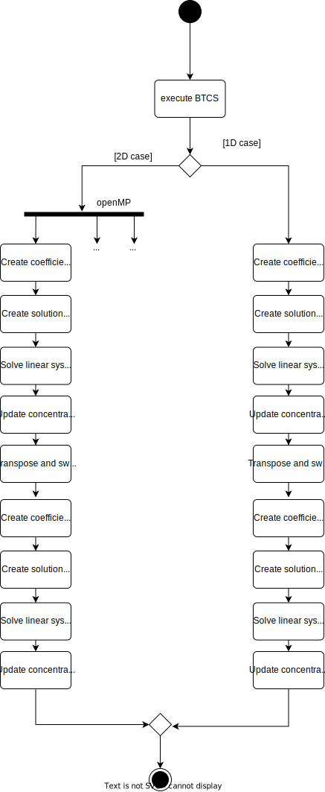

Developer Guide
===============

=========================
Class Diagram of user API
=========================

The following graphic shows the class diagram of the user API. The FTCS and 
BTCS functionalities are externally outsourced and not visible to the user.

.. image:: images/class_diagram.svg
    :width: 2000
    :alt: Class diagram for the user API

====================================================
Activity Diagram for run routine in simulation class
====================================================

The following activity diagram represents the actions when the run method is called within the simulation class. 
For better distinction, the activities of the calculation methods FTCS and BTCS are shown in two separate activity diagrams.

**Activity Diagram for FTCS method**

**Activity Diagram for BTCS method**

