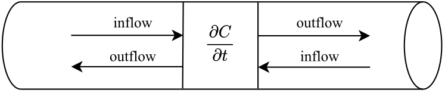
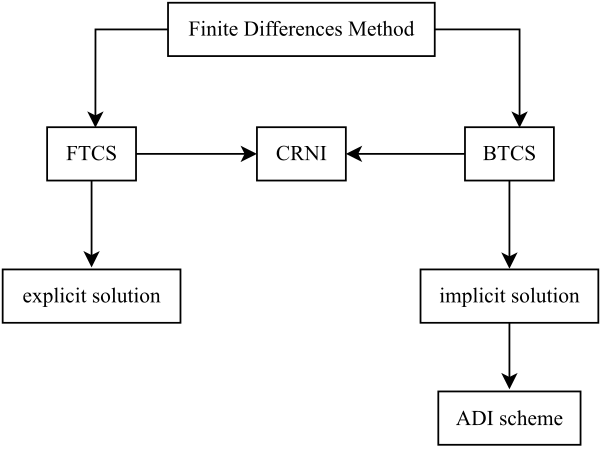
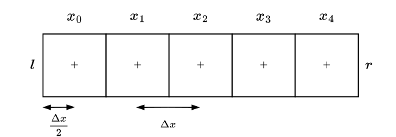
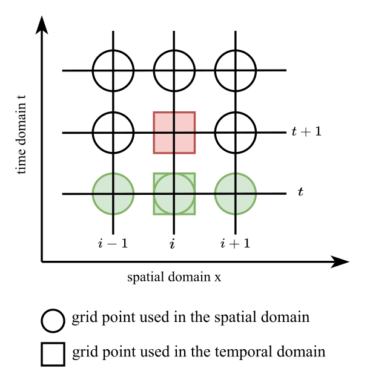
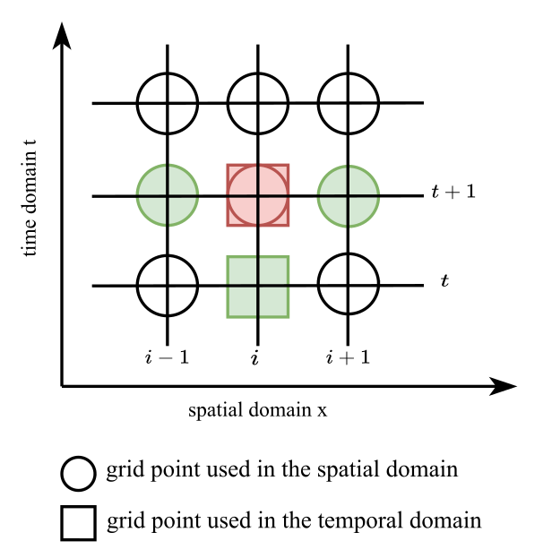
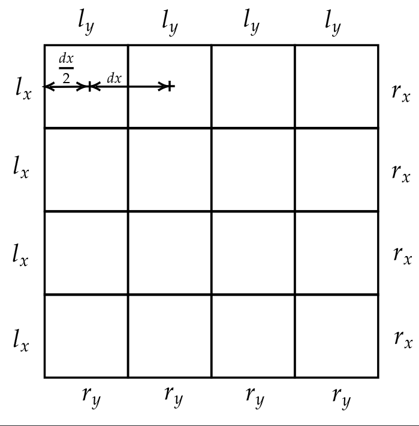
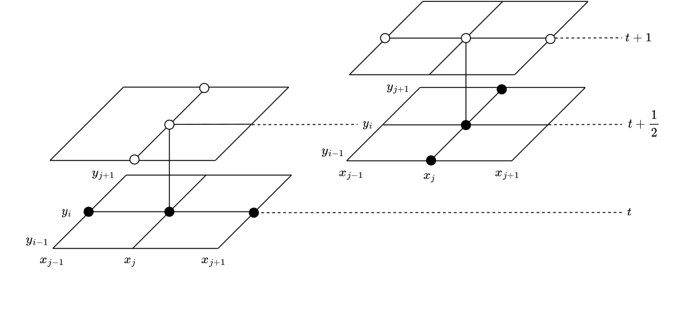

.. Converted content of report from Hannes Signer and Philipp Ungrund
   (https://www.cs.uni-potsdam.de/bs/teaching/docs/lectures/2023/tug-project.pdf)

Theoretical Foundations
=======================

This section describes the theoretical foundation underlying this research
project by answering questions about the background with the mathematical and
scientific equations, the goal of numerically solving these, and their use
cases. It also discusses discretization approaches to the equations that are
needed to calculate results digitally. [BAEHR19]_

Diffusion Equation
------------------

The diffusion equation builds the theoretical bedrock to this research project.
It is a parabolic partial differential equation that is applied in various
scientific fields. It can describe high-level movement of particles suspended in
a liquid or gaseous medium over time and space based on Brownian molecular
motion.

The derivation of the equation simply follows the conservation of mass theorem.
In the following, the derivation always refers to the one-dimensional case
first, but an extension to further dimensions is straightforward. First, let’s
imagine a long tube filled with a liquid or gaseous medium into which we add a
marker substance within a small volume element at the location x.

            Visualization of the law of mass conservation

The boundaries of the volume element are still permeable, so that mass transport
is possible. We refer to the difference of the substance entering and leaving
the volume element as the flux :math:`\Phi` and the concentration of the marker
substance at location :math:`x` at time :math:`t` as :math:`C`. According to the
conservation of mass, it is not possible for this to be created or destroyed.
Therefore, a change in concentration over time must be due to a change in flux
over the volume element. [LOGAN15]_ [SALSA22]_ Formally this leads to

.. _`mass conservation`:

.. math::

   \frac{\partial C}{\partial t} + \frac{\partial \Phi}{\partial x} = 0.

Diffusion relies on random particle collisions based on thermal energy.
The higher the concentration of a substance, the higher the probability
of a particle collision. Fick’s first law describes this relationship as
follows

.. _`ficks law`:

.. math::

   \Phi = -\alpha \cdot \frac{\partial C}{\partial x}.

The law states that the flux moves in the direction of decreasing concentration
[1]_, proportional to the gradient of the concentration in the spatial direction
and a diffusion coefficient :math:`\alpha`. In this context, the diffusion
coefficient represents a measure of the mobility of particles and is given in
the SI unit :math:`\frac{m^2}{s}`. Substituting `ficks law`_ into `mass
conservation`_ now yields the diffusion equation for the one-dimensional case,
which gives the temporal change of the concentration as a function of the
spatial concentration gradient

.. _`one dimensional PDE`:
.. math::

   \begin{aligned}
       \frac{\partial C}{\partial t} - \frac{\partial}{\partial x}\left(\alpha \cdot \frac{\partial C}{\partial x}\right) = 0 \\
       \frac{\partial C}{\partial t} = \alpha \cdot \frac{\partial^2 C}{\partial x^2}.
       \label{eq:}
   \end{aligned}

An extension to two dimensions is easily possible and gives

.. _`two dimensional PDE`:
.. math::

   \begin{aligned}
       \frac{\partial C}{\partial t} = \alpha_x \cdot \frac{\partial^2 C}{\partial x^2} + \alpha_y \cdot \frac{\partial^2 C}{\partial y^2}.
       \label{eq:pde_two_dimensional}
   \end{aligned}

Since this equation now contains both a first order temporal and a
second order spatial derivative, it belongs to the group of partial
differential equations (PDE). In particular, the diffusion problem
belongs to the group of parabolic PDEs. With these, we describe the
evolution of the problem via a first-order time derivative.
[CHAPRA15]_ Furthermore, it describes diffusion under
the assumption of a constant diffusion coefficient in each direction.
Therefore, we distinguish once into the case of homogeneous but
anisotropic diffusion, where the diffusion coefficients are constant in
one spatial direction but may vary between them, and the case of
heterogeneous diffusion. In this case, the diffusion can also change
within one spatial direction. This distinction is important, because the
subsequent discretization of the problem for numerical solution differs
with respect to these two variants.

Numeric and Discretization
--------------------------

The solution of the diffusion equation described above can be solved
analytically for simple cases. For more complicated geometries or
heterogeneous diffusion behavior, this is no longer feasible. In order
to obtain sufficiently accurate solutions, various numerical methods are
available. Basically, we can distinguish between methods of finite
differences and finite elements. The former are mathematically easier to
handle, but limited to a simpler geometry, whereas the latter are more
difficult to implement, but can simulate arbitrarily complicated shapes.
[BAEHR19]_

Since this work is limited to the simulation of two-dimensional grids
with heterogeneous diffusion as the most complicated form, we restrict
ourselves to the application of finite differences and focus on a
performant computation.

There are in principle two methods for solving finite differences with
opposite approaches, as well as one method that uses both methods
equally – the so-called Crank-Nicolson (CRNI) method.

            Methods of finite differences

The idea of finite differences is to replace the partial derivatives of
the PDE to be solved by the corresponding difference quotients for a
sufficiently finely discretized problem. Taylor’s theorem forms the
basis for this possibility. In essence, Taylor states that for a smooth
function [2]_ :math:`f: \mathbb{R} \rightarrow \mathbb{R}`, it is
possible to predict the function value :math:`f(x)` at one point using
the function value and its derivative at another point
:math:`a \in \mathbb{R}`. Formally we can write this as

.. math::

   \begin{aligned}
       f(x) =& f(a) + f'(a) (x-a) + \frac{f''(a)}{2!}(x-a)^2 + ... + \frac{f^{(n)}(a)}{n!}(x-a)^n + R_n\\
       R_n =& \int_{a}^x \frac{(x-t)^n}{n!} f^{(n+1)}(t) dt.
   \end{aligned}

:math:`R_n` denotes the residual term, which also indicates the error in
the case of premature termination of the series. An approximation of the
first derivative is now done simply by truncating the Taylor series
after the first derivative and transforming accordingly
[CHAPRA15]_. This leads to

.. _`first order approximation`:

.. math::

   \begin{aligned}
       f(x_{i+1}) =& f(x_i) + f'(x_i) (x_{i+1}-x_i) + R_1 \\
       f'(x_{i}) =& \underbrace{\frac{f(x_{i+1}) - f(x_i)}{x_{i+1} - x_i}}_{\text{first order approximation}} - \underbrace{\frac{R_1}{x_{i+1} - x_i}}_{\text{truncation error}}.
   \end{aligned}

The `first order approximation`_ shows a so-called forward finite difference
approximation in space, since we use the points at :math:`i` and :math:`i+1` for
the approximation of :math:`f'(x_i)`. Correspondingly, a backward and centered
finite difference approximation is possible applying the appropriate values.

For the approximation of higher derivatives, the combination of several
Taylor series expansions is possible. For example, we set up the
following two Taylor series to derive the centered approximation of the
second derivative

.. _`second order approximations`:
.. math::

   \begin{aligned}
       f(x_{i+1}) =& f(x_i) + f'(x_i) \underbrace{(x_{i+1} - x_i)}_{h} + \frac{f^{''}(x_i)}{2} \underbrace{(x_{i+1} - x_{i})^2}_{h^2} + R_2 \\
       f(x_{i-1}) =& f(x_i) - f'(x_i) \underbrace{(x_{i-1} - x_i)}_{h} + \frac{f^{''}(x_i)}{2} \underbrace{(x_{i-1} - x_{i})^2}_{h^2} +R_2.
   \end{aligned}

Adding [3]_ both `second order approximations`_ and rearranging them according to
the second derivative yields the corresponding approximation

.. _`second order approximation`:
.. math::

   \begin{aligned}
       f^{''}(x_i) = \frac{f(x_{i+1}) - 2\cdot f(x_i) + f(x_{i-1})}{h^2}.
   \end{aligned}

Another possibility of the derivation for the second order approximation results
from the following consideration. The second derivation is just another
derivation of the first one. In this respect we can represent the second
derivative also as the difference of the approximation of the first derivative
[CHAPRA15]_. This results in the following representation, which after
simplification agrees with equation `second order approximation`_

.. _`first order derivative`:
.. math::

   \begin{aligned}
       f^{''}(x_i) = \frac{\frac{f(x_{i+1}) - f(x_i)}{h} - \frac{f(x_i) - f(x_{i-1})}{h}}{h}.
       \label{eq:first_order_derivative}
   \end{aligned}

The above equations are all related to a step size :math:`h`. Let us imagine a
bar, which we want to discretize by dividing it into individual cells.

            Discretization of a one-dimensional surface

In the discretization, the step size :math:`h` would correspond to the distance
between the cell centers :math:`\Delta x`. Now, the question arises how to deal
with the boundaries? This question is a topic of its own, whereby numerous
boundary conditions exist. At this point, only the cases relevant to this work
will be presented. First, let us look at the problem intuitively and consider
what possible boundary conditions can occur. A common case is an environment
that is isolated from the outside world. That is, the change in concentration at
the boundary over time has to be zero. We can generalize this condition to the
*Neumann boundary condition*, where the derivative at the boundary is given. The
case of a closed system then arises with a derivative of zero, so that there can
be no flow across the boundary of the system. Thus, the Neumann boundary
condition for the left side yields the following formulation

.. math::

   \begin{aligned}
       \text{Neumann condition for the left boundary:~} \frac{\partial C(x_{0-\frac{\Delta x}{2}}, t)}{\partial t} = g(t) \text{,~} t > 0.
   \end{aligned}

The second common case is a constant boundary. Again, the case can be
generalized, this time to the so-called *Dirichlet boundary condition*. Here,
the function value of the boundary is given instead of its derivative. For the
example we can write this boundary condition as

.. math::

   \begin{aligned}
       \text{Dirichlet condition for the left boundary:~} C(x_{0 - \frac{\Delta x}{2}}, t) = h(t) \text{, ~} t > 0.
   \end{aligned}

In practise, constants are often used instead of time-dependent
functions. [LOGAN15]_ [CHAPRA15]_ [SALSA22]_

With this knowledge, we can now turn to the concrete implementation of
finite differences for the explicit and implicit scheme. Centered
differences are always used for the spatial component. Only in the time
domain we distinguish into forward (FTCS method) and backward (BTCS
method) methods, which influence the corresponding solution
possibilities and stability properties.

Explicit Scheme (FTCS)
~~~~~~~~~~~~~~~~~~~~~~

FTCS stands for *Forward Time, Centered Space* and is an explicit
procedure that can be solved iteratively. Explicit methods are generally
more accurate, but are limited in their time step, so that incorrectly
chosen time steps lead to instability of the method. Hoewever, there are
estimates, such as the Courant-Friedrich-Lewy stability conditions,
which gives the corresponding maximum possible time steps.
[CHAPRA15]_

The goal now is to approximate both sides of the `one dimensional PDE`_. As the
name of the method FTCS indicates, we use a forward approximation for the left
temporal component. For the right-hand side, we use a central approximation
using the `first order derivative`_. This results in the following approximation
for the inner cells (in the example the cells :math:`x_1`, :math:`x_2` and
:math:`x_3`) and a constant diffusion coefficient :math:`\alpha`

.. _`approximate first order diffusion`:
.. math::

   \begin{aligned}
       \frac{C_i^{t+1}-C_i^t}{\Delta t}=\alpha \frac{\frac{C_{i+1}^t-C_i^t}{\Delta x}-\frac{C_i^t-C_{i-1}^t}{\Delta x}}{\Delta x}.
       \label{eq:approx_first_order_diffusion}
   \end{aligned}

By rearranging this equation according to the concentration value for the next
time step :math:``C_i^{t+1}`, we get

.. _`explicit scheme`:
.. math::

   \begin{aligned}
       C_i^{t+1} = C_i^t + \frac{\alpha \cdot \Delta t}{\Delta x^2} \left[C_{i+1}^t - 2C_i^t + C_{i-1}^t \right].
       \label{eq:explicit_scheme}
   \end{aligned}

At this point, it should be clear why this method is an explicit procedure. On
the right side of the `explicit scheme`_, there are only known quantities, so
that an explicit calculation rule is given. The basic procedure is shown in
Figure 4. In the case of an explicit procedure, we use the values of the
neighboring cells of the current time step to approximate the value of a cell
for the next time step.

            Illustration for using the existing values in the time domain (green) for approximation of the next time step (red)

As described above, the `explicit scheme`_ applies only to the inner cells. For
the edges we now have to differentiate between the already presented boundary
conditions of Dirichlet and Neumann. To do this, we look again at the
`approximate first order diffusion`_ and consider what would have to be changed
in the case of constant boundary conditions (Dirichlet). It quickly becomes
apparent that in the case of the left cell the value :math:`C_{i-1}` corresponds
to the constant value of the left boundary :math:`l` and in the case of the
right cell :math:`C_{i+1}` to the value of the right boundary :math:`r`. In
addition, the length difference between the cells is now no longer :math:`\Delta
x`, but only :math:`\frac{\Delta x}{2}`, as we go from the center of the cell to
the edge. For a given flux, the first derivative has to take this value. In our
case, this is approximated with the help of the difference quotient, so that
this is omitted in the case of a closed boundary (the flux is equal to zero) or
accordingly assumes a constant value. For the left-hand boundary, this results
in the following modifications, whereas the values for the right-hand boundary
can be derived equivalently

.. _`boundary conditions`:
.. math::

   \begin{aligned}
       \text{Dirichlet for the left boundary:~}& \frac{C_0^{t+1}-C_0^t}{\Delta t}=\alpha \frac{\frac{C_{1}^t-C_0^t}{\Delta x}-\frac{C_0^t-l}{{\frac{\Delta x}{2}}}}{\Delta x}\\
       &C_{0}^{t+1} = C_{0}^t + \frac{\alpha \Delta t}{\Delta x^2} \left [C_{1}^t - 3 C_0^t + 2l \right]\\
       \text{Closed Neumann for the left boundary:~}&  \frac{C_0^{t+1}-C_0^t}{\Delta t}=\alpha \frac{\frac{C_{1}^t-C_0^t}{\Delta x}-\cancelto{0}{l}}{\Delta x}\\
       &C_{0}^{t+1} = C_{0}^t + \frac{\alpha \Delta t}{\Delta x^2} \left [C_1^t - C_0^t \right].
       \label{eq:boundary_conditions}
   \end{aligned}

Again, it is straightforward to extend the `explicit scheme`_ to the second
dimension, so that the following formula is simply obtained for the inner cells

.. math::

   \begin{aligned}
       C_{i,j}^{t+1} = C_{i,j}^t +& \frac{\alpha_x \cdot \Delta t}{\Delta x^2} \left[C_{i, j+1}^t - 2C_{i,j}^t + C_{i, j-1} \right] \\
       +& \frac{\alpha_y \cdot \Delta t}{\Delta y^2} \left[C_{i+1, j}^t - 2C_{i,j}^t + C_{i-1, j} \right].
   \end{aligned}

Here, it is important to note that the indices :math:`i` and :math:`j`
for the two-dimensional cases are now used as usual in the matrix
notation. That means :math:`i` marks the elements in x-direction and
:math:`j` in y-direction.

The previous equations referred to homogeneous diffusion coefficients, i.e. the
diffusion properties along a spatial direction are identical. However, we are
often interested in applications where different diffusion coefficients act in
each discretized cell. This extension of the problem also leads to a slightly
modified variant of our `one dimensional PDE`_, where the diffusion coefficient
now is also a function of the spatial component

.. math::

   \begin{aligned}
       \frac{\partial C}{\partial t} = \frac{\partial}{\partial x}\left[\alpha(x) \frac{\partial C}{\partial x} \right].
   \end{aligned}

For this case, the literature recommends discretizing the problem
directly at the boundaries of the grid cells, i.e. halfway between the
grid points [FROLKOVIC1990]_. If we
follow this scheme and approximate the first derivative for C at the
appropriate cell boundaries, we obtain the following expressions

.. math::

   \begin{aligned}
      \begin{cases}
          \alpha(x_{i+\frac{1}{2}}) \frac{\partial C}{\partial x}(x_{i+\frac{1}{2}}) = \alpha_{i+\frac{1}{2}} \left(\frac{C_{i+1} - C_i}{\Delta x}\right)\\
          \alpha(x_{i-\frac{1}{2}}) \frac{\partial C}{\partial x}(x_{i-\frac{1}{2}}) = \alpha_{i-\frac{1}{2}} \left(\frac{C_{i} - C_{i-1}}{\Delta x}\right).
      \end{cases}
   \end{aligned}

With a further derivation we now obtain a spatially centered
approximation with

.. math::

   \begin{aligned}
       \frac{\partial }{\partial x}\left(\alpha(x) \frac{\partial C}{\partial x} \right) \simeq& \frac{1}{\Delta x}\left[\alpha_{i+\frac{1}{2}}\left(\frac{C^t_{i+1}-C^t_i}{\Delta x}\right)-\alpha_{i-\frac{1}{2}}\left(\frac{C^t_i-C^t_{i-1}}{\Delta x}\right)\right] \\
       \frac{C^{t+1}_{i}-C^t_i}{\Delta t}=& \frac{1}{\Delta x^2}\left[\alpha_{i+\frac{1}{2}} C^t_{i+1}-\left(\alpha_{i+\frac{1}{2}}+\alpha_{i-\frac{1}{2}}\right) C^t_i+\alpha_{i-\frac{1}{2}} C^t_{i-1}\right]\\
        C^{t+1}_{i} =& C^t_i + \frac{\Delta t}{\Delta x^2} \left[\alpha_{i+\frac{1}{2}} C^t_{i+1}-\left(\alpha_{i+\frac{1}{2}}+\alpha_{i-\frac{1}{2}}\right) C^t_i+\alpha_{i-\frac{1}{2}} C^t_{i-1} \right].
   \end{aligned}

The value for the inter-cell diffusion coefficients can be determined by
either the arithmetic or harmonic mean of both cells, with the harmonic
mean being preferred for the default case. Again, we can extend this
equation to two dimensions, resulting in the following iteration rule

.. math::

   \begin{aligned}
       C_{i, j}^{t+1}= & C_{i, j}^t+ \frac{\Delta t}{\Delta x^2}\left[\alpha_{i, j+\frac{1}{2}}^x C_{i, j+1}^t-\left(\alpha_{i, j+\frac{1}{2}}^x+\alpha_{i, j-\frac{1}{2}}^x\right) C_{i, j}^t+\alpha_{i, j-\frac{1}{2}}^x C_{i, j-1}^t \right]+ \\ & \frac{\Delta t}{\Delta y^2}\left[\alpha_{i+\frac{1}{2}, j}^y C_{i+1, j}^t-\left(\alpha_{i+\frac{1}{2}, j}^y+\alpha_{i-\frac{1}{2}, j}^y\right) C_{i, j}^t+\alpha_{i-\frac{1}{2}, j}^y C_{i-1, j}^t \right].
   \end{aligned}

The corresponding equations for the boundary conditions can be derived
analogously to the homogeneous case (cf. `boundary conditions`_) by adjusting
the relevant difference quotients to the respective boundary condition. As
described initially, the FTCS procedure is accurate but not stable for each time
step. The Courant-Friedrichs-Lewy stability condition states that the time step
must always be less than or equal the following value

.. math::

   \begin{aligned}
       \Delta t \leq \frac{\min (\Delta x^2, \Delta y^2)}{4 \cdot \max (\alpha^x, \alpha^y)}.
   \end{aligned}

That is, the maximum time step is quadratically related to the
discretization and linearly to the maximum diffusion coefficient.
Especially for very fine-resolution grids, this condition has a
particularly strong effect on that required computing time. This is in
contrast to the implicit methods, which we will now look at in more
detail. Unlike the explicit methods, the implicit methods are
unconditionally stable.

Implicit Scheme (BTCS)
~~~~~~~~~~~~~~~~~~~~~~

The main difference to the explicit method is that the discretization is not
done at the time step :math:`t` as in the `approximate first order diffusion`_,
but now at the time step :math:`t+1`. Hence, the neighboring cells in the next
time step are used for the approximation of the middle cell.

            Illustration of the implicit method, where the values of the neighboring cells in the next time step are used for the approximation

The `approximate first order diffusion`_ thus changes to

.. math::

   \begin{aligned}
     \frac{C_i^{t+1}-C_i^t}{\Delta t} & =\alpha \frac{\frac{C_{i+1}^{t+1}-C_i^{t+1}}{\Delta x}-\frac{C_i^{t+1}-C_{i-1}^{t+1}}{\Delta x}}{\Delta x} \\
     & =\alpha \frac{C_{i-1}^{t+1}-2 C_i^{t+1}+C_{i+1}^{t+1}}{\Delta x^2}
   \end{aligned}

Now there is no possibility to change the equation to :math:`C^{t+1}_i`
so that all values are given. That means :math:`C^{t+1}_i` is only
implicitly indicated. If we know put all known and unkown values on one
side each and define :math:`s_x = \frac{\alpha \Delta t}{\Delta x^2}`
for simplicity, we get the following expression

.. math::

   \begin{aligned}
       s_x \cdot C_{i+1}^{t+1} + (-1-s_x) \cdot C_i^{t+1} + s_x \cdot C_{i-1}^{t+1} &= -C_i^t.
       \label{eq:implicit_inner_grid}
   \end{aligned}

This applies only to the inner grid without boundaries. To derive the equations
for the boundaries, the reader can equivalently use the procedure from the FTCS
method with given `boundary conditions`_. Thus, for constant boundaries with the
values :math:`l` and :math:`r` for the left and right boundaries, respectively,
the following two equations are obtained

.. math::

   \begin{aligned}
       \left(-1-3 s_x\right) \cdot C_0^{t+1}+s_x \cdot C_1^{t+1} &= -C_0^t - 2s_x \cdot l \\
       s_x \cdot C_{n-1}^{t+1}+\left(-1-3 s_x\right) \cdot C_n^{t+1} &= -C_n^t - 2s_x \cdot r.
   \end{aligned}

The question now arises how values from the next time step can be used for the
approximation. Here, the answer lies in the simultaneous solution of the
equations. Let’s look again at the example in Figure for conservation law and
establish the implicit equations for the same. We obtain the following system of
five equations and five unknowns

.. math::

   \begin{aligned}
       \begin{cases}
           \left(-1-3 s_x\right) \cdot C_0^{t+1}+s_x \cdot C_1^{t+1} &= -C_0^t - 2s_x \cdot l \\
           s_x \cdot C_{2}^{t+1} + (-1-s_x) \cdot C_1^{t+1} + s_x \cdot C_{0}^{t+1} &= -C_1^t \\
           s_x \cdot C_{3}^{t+1} + (-1-s_x) \cdot C_2^{t+1} + s_x \cdot C_{1}^{t+1} &= -C_2^t \\
           s_x \cdot C_{4}^{t+1} + (-1-s_x) \cdot C_3^{t+1} + s_x \cdot C_{2}^{t+1} &= -C_3^t \\
           s_x \cdot C_{3}^{t+1}+\left(-1-3 s_x\right) \cdot C_4^{t+1} &= -C_4^t - 2s_x \cdot r.
       \end{cases}
   \end{aligned}

If we transfer this system of equations to a matrix-vector system, we
get

.. math::

   \begin{aligned}
       \begin{bmatrix}
           -1-3s_x & s_x & 0 & 0 & 0 \\
           s_x & -1-3s_x & s_x & 0 & 0 \\
           0 & s_x & -1-3s_x & s_x & 0 \\
           0 & 0 & s_x & -1-3s_x & s_x \\
           0 & 0 & 0 & s_x & -1-3s_x
       \end{bmatrix}
       \cdot
       \begin{bmatrix}
           -C_0^{t+1}\\
           -C_1^{t+1}\\
           -C_2^{t+1}\\
           -C_3^{t+1}\\
           -C_4^{t+1}
       \end{bmatrix}
       =
       \begin{bmatrix}
           -C_0^t - 2s_x \cdot l \\
           -C_1^t \\
           -C_2^t \\
           -C_3^t \\
           -C_4^t - 2s_x \cdot r
       \end{bmatrix}.
   \end{aligned}

This system can now be solved very efficiently, since it is a so-called
tridiagonal system. Very fast solution algorithms exist for this, such
as the Thomas algorithm.

In principle, this procedure can be extended again to the
two-dimensional case, but here no tridiagonal system arises any more, so
that the efficient solution algorithms are no longer applicable.
Therefore, one uses a trick and solves the equations in two half time
steps. In the first time step from :math:`t\rightarrow t+\frac{1}{2}`
one space direction is calculated implicitly and the other one
explicitly, whereas in the second time step from
:math:`t+\frac{1}{2} \rightarrow t+1` the whole process is reversed and
the other space direction is solved by the implicit method. This
approach is called the alternative-direction implicit method, which we
will now examine in more detail.

First, we consider the `two dimensional PDE`_ again, which represents the PDE
for diffusion in the two-dimensional case with homogeneous and anisotropic
diffusion coefficients. As explained in the upper sections, we can approximate
the second derivative for each spatial direction as follows

.. _`Taylor series`:
.. math::

   \begin{aligned}
       \frac{\partial^2 C^t_{i, j}}{\partial x^2} =& \frac{C^t_{i, j-1} - 2C^t_{i,j} + C^t_{i, j+1}}{\Delta x^2} \label{eq:taylor_2_x}\\
       \frac{\partial^2 C^t_{i, j}}{\partial y^2} =& \frac{C^t_{i-1, j} - 2C^t_{i,j} + C^t_{i+1, j}}{\Delta y^2}. \label{eq:taylor_2_y}
   \end{aligned}

Explicit solution methods, as can be used in the one-dimensional case,
require smaller time steps to remain stable when applied to solve
two-dimensional problems. This leads to a significant increase in the
computational effort. Implicit techniques also require more
computational capacity, since the matrices can no longer be represented
tridiagonally in the two- or three-dimensional case and thus cannot be
solved efficiently. A solution to this problem is provided by the ADI
(alternating-direction implicit) scheme, which transforms
two-dimensional problems back into tridiagonal matrices. Here, each time
step is performed in two half-steps, each time solving implicitly in one
axis direction. [CHAPRA15]_ For the above equations,
the ADI scheme is defined as follows

.. math::

   \begin{aligned}
       \begin{cases}
           \frac{C_{i,j}^{t+\frac{1}{2}}-C_{i,j}^t}{\frac{\Delta t}{2}} = \alpha_x \cdot \frac{\partial^2 C_{i,j}^{t+\frac{1}{2}}}{\partial x^2} + \alpha_y \frac{\partial^2 C_{i,j}^t}{\partial y^2} \\
           \frac{C_{i,j}^{t+1}-C_{i,j}^{t+\frac{1}{2}}}{\frac{\Delta t}{2}} = \alpha_x \cdot \frac{\partial^2 C_{i,j}^{t+\frac{1}{2}}}{\partial x^2} + \alpha_y \frac{\partial^2 C_{i,j}^{t+1}}{\partial y^2}
       \end{cases}.
       \label{eq:adi_scheme}
   \end{aligned}

Now the `Taylor series`_ can be substituted into the equation and the term
:math:`\frac{\Delta t}{2}` can be placed on the right side of the equation. The
following expression is generated when introducing :math:`s_x = \frac{\alpha_x
\cdot \Delta t}{2 \cdot \Delta x^2}` and :math:`s_y = \frac{\alpha_y \cdot
\Delta t}{2 \cdot \Delta y^2}` as new variables

.. math::

   \begin{aligned}
       C_{i,j}^{t+\frac{1}{2}} - C_{i,j}^t &= s_x \cdot \left[~C_{i, j-1}^{t+\frac{1}{2}}-2 C_{i,j}^{t+\frac{1}{2}}+C_{i, j+1}^{t+\frac{1}{2}}\right] + s_y~ \cdot \left[~ C_{i-1, j}^t - 2\cdot C_{i,j}^t + C_{i+1,j}^t\right] \\
       C_{i,j}^{t+1} - C_{i,j}^{t+\frac{1}{2}} &= s_x \cdot \left[C_{i, j-1}^{t+\frac{1}{2}}-2 C_{i,j}^{t+\frac{1}{2}}+C_{i, j+1}^{t+\frac{1}{2}}\right] + s_y \cdot ~\left[ C_{i-1, j}^{t+1} - 2\cdot C_{i,j}^{t+1} + C_{i+1,j}^{t+1}\right].
   \end{aligned}

As it can be obtained by the following Figure the above equations are only valid
for the inner grid.

            Example grid with boundary conditions

At the edge of
the grid, starting from the cell center, it is not possible to take a
full step :math:`dx`, but only a half step :math:`\frac{dx}{2}`.
Therefore, the approximation for the inner cells (shown as an example
for the x-direction)

.. math::

   \begin{aligned}
       \frac{C_{i,j}^{t+1} - C_{i,j}^t}{\Delta t} = \frac{\frac{C_{i, j+1}^{t+1} - C_{i,j}^{t+1}}{\Delta x} - \frac{C_{i, j}^{t+1} - C_{i, j-1}^{t+1}}{\Delta x}}{\Delta x} = \frac{C_{i, j+1}^{t+1} - 2 \cdot C_{i, j}^{t+1} + C_{i, j-1}^{t+1}}{\Delta x^2}
   \end{aligned}

is no longer valid and we have to perform the same changes to the
boundary conditions as for the other methods by replacing the
corresponding concentration values or difference quotiens with the
respective boundary concentrations or fluxes depending on the boundary
condition (Neumann or Dirichlet).

We can now quickly introduce the ADI scheme for heterogeneous diffusion
by using the same discretization logic as for the FTCS procedure and
discretizing the points between cells.

This results in the following ADI scheme

.. math::

   \begin{aligned}
   \begin{cases}
       \frac{C_{i, j}^{t+\frac{1}{2}}-C_{i, j}^t}{\Delta \frac{t}{2}}= & \frac{1}{\Delta x^2}\left[\alpha_{i, j+ \frac{1}{2}} C_{i, j+1}^{t+ \frac{1}{2}}-\left(\alpha_{i, j+ \frac{1}{2}}+\alpha_{i, j- \frac{1}{2}}\right) C_{i, j}^{t+ \frac{1}{2}}+\alpha_{i, j-\frac{1}{2}} C_{i, j-1}^{t+\frac{1}{2}}\right]+ \\ & \frac{1}{\Delta y^2}\left[\alpha_{i+\frac{1}{2}, j} C_{i+1, j}^t-\left(\alpha_{i+\frac{1}{2}, j}+\alpha_{i-\frac{1}{2}, j}\right) C_{i, j}^t+\alpha_{i-\frac{1}{2}, j} C_{i-1, j}^t\right] \\
       \frac{C_{i, j}^{t+1}-C_{i, j}^{t+\frac{1}{2}}}{\Delta \frac{t}{2}}= & \frac{1}{\Delta x^2}\left[\alpha_{i, j+\frac{1}{2}} C_{i, j+1}^{t+\frac{1}{2}}-\left(\alpha_{i, j+\frac{1}{2}}+\alpha_{i, j-\frac{1}{2}}\right) C_{i, j}^{t+\frac{1}{2}}+\alpha_{i, j-\frac{1}{2}} C_{i, j-1}^{t+\frac{1}{2}}\right]+ \\ & \frac{1}{\Delta y^2}\left[\alpha_{i+\frac{1}{2}, j} C_{i+1, j}^{t+1}-\left(\alpha_{i+\frac{1}{2}, j}+\alpha_{i-\frac{1}{2}, j}\right) C_{i, j}^{t+1}+\alpha_{i-\frac{1}{2}, j} C_{i-1, j}^{t+1}\right].
   \end{cases}
       \end{aligned}

.. math::

   \begin{aligned}
       \begin{cases}
       -s_x \alpha_{i, j+\frac{1}{2}}^x C_{i, j+1}^{t+\frac{1}{2}}+\left(1+s_x\left(\alpha_{i, j+\frac{1}{2}}^x+\alpha_{i, j-\frac{1}{2}}^x\right)\right) C_{i, j}^{t+\frac{1}{2}}-s_x \alpha_{i, j-\frac{1}{2}}^x C_{i, j-1}^{t+\frac{1}{2}}= \\ s_y \alpha_{i+\frac{1}{2}, j}^y C_{i+1, j}^t+\left(1-s_y\left(\alpha_{i+\frac{1}{2}, j}^y+\alpha_{i-\frac{1}{2}, j}^y\right)\right) C_{i, j}^t+s_y \alpha_{i-\frac{1}{2}, j}^y C_{i-1, j}^t\\
   -s_y \alpha_{i+\frac{1}{2}, j}^y C_{i+1, j}^{t+1}+\left(1+s_y\left(\alpha_{i+\frac{1}{2}, j}^y+\alpha_{i-\frac{1}{2}, j}^y\right)\right) C_{i, j}^{t+1}-s_y \alpha_{i-\frac{1}{2}, j}^y C_{i-1, j}^{t+1}= \\ s_x \alpha_{i, j+\frac{1}{2}}^x C_{i, j+1}^{t+\frac{1}{2}}+\left(1-s_x\left(\alpha_{i, j+\frac{1}{2}}^x+\alpha_{i, j-\frac{1}{2}}^x\right)\right) C_{i, j}^{t+\frac{1}{2}}+s_x \alpha_{i, j-\frac{1}{2}}^x C_{i, j-1}^{t+\frac{1}{2}}.
   \end{cases}
   \end{aligned}

Rearranging the terms according to known and unknown quantities gives us again
the scheme as in the one-dimensional case and allows us to set up a tridiagonal
system for each row of the grid. We also have to take into account that the ADI
method always requires two calculation steps for each complete time step.
However, since the implicit method is unconditionally stable, it shows its
adavantage especially with larger time steps. The basic procedure of the ADI
scheme with the two time steps is shown here:

            Illustration of the iterative procedure in the ADI process

Crank-Nicolson method
---------------------

Another implicit method is the Crank-Nicolson (CRNI) method, which uses both
forward and backward approximations. As this method does not represent a main
goal of this work, it is only briefly mentioned here. Essentially, the
Crank-Nicolson method averages the two finite differences variants at the
corresponding point. For the one-dimensional case this results in

.. math::

   \begin{aligned}
       \frac{C^{t+1}_i - C_i^{t}}{\Delta t} = \frac{1}{2} \cdot \left[\frac{C^{t}_{i+1} - 2C^t_i + C_{i+1}^t}{\Delta x^2} + \frac{C^{t+1}_{i+1} - 2C_i^{t+1} + C_i^{t+1}}{\Delta x^2} \right].
   \end{aligned}

By transforming the terms accordingly, it is also possible to generate a
tridiagonal matrix, as in the BTCS method, which can be solved very
efficiently with the Thomas algorithm. [CHAPRA15]_
Like the BTCS method, CRNI is unconditionally stable, but becomes
inaccurate if the time steps are too large. Compared to the FTCS and
BTCS methods, which have a temporal truncation error of
:math:`\mathcal{O}(\Delta t)`, the CRNI method with an error of
:math:`\mathcal{O}(\Delta t^2)` has an advantage and should be preferred
for time-accurate solutions.

.. [LOGAN15] Logan, J. David. Applied Partial Differential Equations.
             Undergraduate Texts in Mathematics. Cham: Springer International
             Publishing, 2015. https://doi.org/10.1007/978-3-319-12493-3.

.. [SALSA22] Salsa, Sandro, and Gianmaria Verzini. Partial Differential
             Equations in Action. Vol. 147. UNITEXT. Cham: Springer
             International Publishing, 2022.
             https://doi.org/10.1007/978-3-031-21853-8.

.. [CHAPRA15] Chapra, Steven C., and Raymond P. Canale. Numerical Methods for
              Engineers, 2015.

.. [BAEHR19] Baehr, Hans Dieter, and Karl Stephan. Wärme- Und Stoffübertragung.
             Berlin, Heidelberg: Springer Berlin Heidelberg, 2019.
             https://doi.org/10.1007/978-3-662-58441-5.

.. [FROLKOVIC1990] Frolkovič, Peter. “Numerical Recipes: The Art of Scientific
                   Computing.” Acta Applicandae Mathematicae 19, no. 3 (June
                   1990): 297–99. https://doi.org/10.1007/BF01321860.

.. [1]
   The minus sign ensures that the direction of the flux follows the
   decrease in concentration.

.. [2]
   A function is called smooth if it is arbitrarily often
   differentiable.

.. [3]
   The remainder term is not considered further at this point, but is
   :math:`\mathcal{O}(h^2)` in the centered variant. Thus, the centered
   variant is more accurate than the forward or backward oriented
   method, whose errors can be estimated with :math:`\mathcal{O}(h)`.
   [CHAPRA15]_
